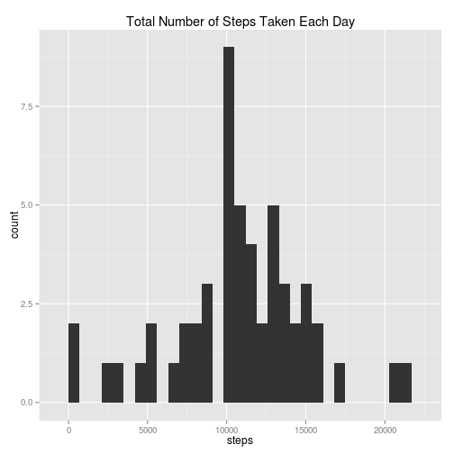
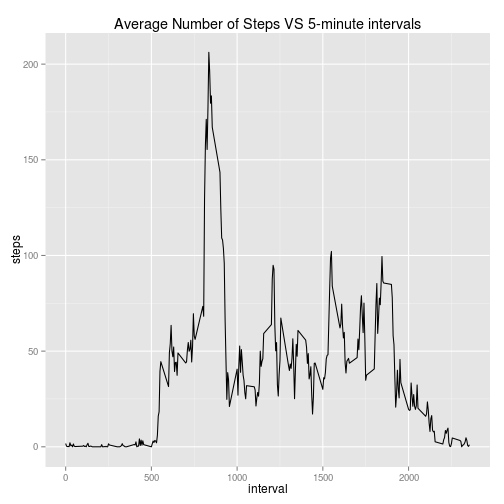
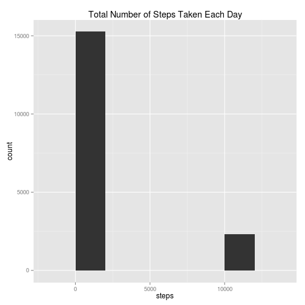
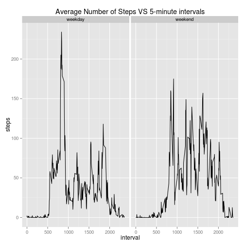

## Loading and preprocessing the data
First, we load all libraries and data that we will use:

```r
library(ggplot2)
library(dplyr)
unzip("activity.zip")
x=read.csv("activity.csv")
#make sure the date si in Date format
x$date=(as.Date(as.character(x$date),"%Y-%m-%d"))
```

## What is mean total number of steps taken per day?
Sum of steps per day:

```r
stepdate=aggregate(steps~date,x,sum,na.rm=T)
stepdate
```

```
##          date steps
## 1  2012-10-02   126
## 2  2012-10-03 11352
## 3  2012-10-04 12116
## 4  2012-10-05 13294
## 5  2012-10-06 15420
## 6  2012-10-07 11015
## 7  2012-10-09 12811
## 8  2012-10-10  9900
## 9  2012-10-11 10304
## 10 2012-10-12 17382
## 11 2012-10-13 12426
## 12 2012-10-14 15098
## 13 2012-10-15 10139
## 14 2012-10-16 15084
## 15 2012-10-17 13452
## 16 2012-10-18 10056
## 17 2012-10-19 11829
## 18 2012-10-20 10395
## 19 2012-10-21  8821
## 20 2012-10-22 13460
## 21 2012-10-23  8918
## 22 2012-10-24  8355
## 23 2012-10-25  2492
## 24 2012-10-26  6778
## 25 2012-10-27 10119
## 26 2012-10-28 11458
## 27 2012-10-29  5018
## 28 2012-10-30  9819
## 29 2012-10-31 15414
## 30 2012-11-02 10600
## 31 2012-11-03 10571
## 32 2012-11-05 10439
## 33 2012-11-06  8334
## 34 2012-11-07 12883
## 35 2012-11-08  3219
## 36 2012-11-11 12608
## 37 2012-11-12 10765
## 38 2012-11-13  7336
## 39 2012-11-15    41
## 40 2012-11-16  5441
## 41 2012-11-17 14339
## 42 2012-11-18 15110
## 43 2012-11-19  8841
## 44 2012-11-20  4472
## 45 2012-11-21 12787
## 46 2012-11-22 20427
## 47 2012-11-23 21194
## 48 2012-11-24 14478
## 49 2012-11-25 11834
## 50 2012-11-26 11162
## 51 2012-11-27 13646
## 52 2012-11-28 10183
## 53 2012-11-29  7047
```

Histogram of the above data:

```r
ggplot(stepdate,aes(steps))+geom_histogram(binwidth=700)+ggtitle("Total Number of Steps Taken Each Day")
```

 

The mean of total number of steps taken per day is:

```r
meanstep=mean(stepdate$steps)
meanstep
```

```
## [1] 10766.19
```

The median of total number of steps taken per day is:

```r
medstep=median(stepdate$steps)
medstep
```

```
## [1] 10765
```

## What is the average daily activity pattern?
5-minute interval by the average number of steps taken, averaged across all days 

```r
stepmeanint=aggregate(steps~interval,x,mean,na.rm=T)
ggplot(stepmeanint,aes(interval,steps))+geom_line()+ggtitle("Average Number of Steps VS 5-minute intervals")
```

 
there seems to be a spike in the lower end of the interval.

We can see which one this is by looking at the interval containing maximum average number of steps, which is :

```r
maxintrow=which(stepmeanint$steps==max(stepmeanint$steps))
stepmeanint[maxintrow,1]
```

```
## [1] 835
```

this is what the whole row looks like

```r
stepmeanint[maxintrow,]
```

```
##     interval    steps
## 104      835 206.1698
```
## Imputing missing values
This is the number of NAs:

```r
seena=table(is.na(x))
seena[2]
```

```
## TRUE 
## 2304
```

to get rid of the NAs, we will find and replace missing values in steps, we'll use the total mean steps from above for filler, what could possibly go wrong?

```r
#subset the NA so we can pinpoint the missing data
nadata=subset(x,is.na(x))
#isolate the ones that aren't missing too
notnadata=subset(x,!is.na(x))
nadateslist=as.list(unique(nadata$date))
#fill in the missing data with previous mean
nadata$steps=meanstep
#create new dataset with no more missing data
full=rbind(nadata,notnadata)
fullstepdate=aggregate(steps~date,full,sum,na.rm=T)
#create histogram
ggplot(full,aes(steps))+geom_histogram(binwidth=2000)+ggtitle("Total Number of Steps Taken Each Day")
```

 

The mean of total number of steps taken per day after adding the filler becomes:

```r
fullmeanstep=mean(fullstepdate$steps)
fullmeanstep
```

```
## [1] 415998.5
```

The mean of total number of steps taken per day after adding the filler becomes:

```r
fullmedstep=median(fullstepdate$steps)
fullmedstep
```

```
## [1] 11458
```

As we can see above, imputing the NA -- especially in this case where there were 2304 NAs of the total of 17568 observations -- could cause major change in the analysis.


## Are there differences in activity patterns between weekdays and weekends?
add to the dataset actual days 

```r
xdays=mutate(x,days=weekdays(date))
```

categorize weekdays and weekends

```r
xdays=xdays %>% mutate(week = ifelse(xdays$days == "Monday","weekday",ifelse(xdays$days == "Tuesday","weekday",ifelse(xdays$days =="Wednesday","weekday",ifelse(xdays$days =="Thursday","weekday",ifelse(xdays$days =="Friday","weekday",ifelse(xdays$days == "Saturday","weekend",ifelse(xdays$days =="Sunday","weekend", 0))))))))
```

plot average number of steps taken VS weekday days or weekend days:

```r
stepmeanintweek=aggregate(steps~interval+week,xdays,mean,na.rm=T)
ggplot(stepmeanintweek,aes(interval,steps))+geom_line()+ggtitle("Average Number of Steps VS 5-minute intervals")+facet_grid(.~week)
```

 

people seem to be more active overall during weekends.
